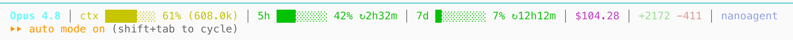

# claude-code-statusline-usage

**English** · [简体中文](README.zh-CN.md)

> A non-invasive **realtime usage status line for Claude Code** — shows the current model, context-window %, your Claude.ai 5-hour / 7-day (weekly) rate-limit usage, session cost, and diff stats, right above the prompt. Pure-stdlib Python, wired in through the official `statusLine` extension point: no app-bundle patching, survives upgrades. Every column is toggleable and reorderable.
>
> Keywords: Claude Code, Claude.ai usage, rate limit, 5-hour limit, weekly usage, Max plan, context window, token usage, cost tracker, terminal status line.

Adds one **realtime usage** line to your Claude Code terminal (right above the input box): current model, context-window usage, your Claude.ai 5-hour window / weekly usage, cumulative cost, changed line count, and working directory. Every column is **toggleable and reorderable**.

<p align="center">
  <br>
  <sub>Live screenshot</sub>
</p>

```
Opus 4.7 (1M) │ ctx ██░░░░░░ 24% (237k) │ 5h ███░░░░░ 38% ↻2h53m │ 7d █░░░░░░░ 18% ↻10h33m │ $0.83 │ +42 -3 │ claude_code_patch
```

It stays **in the same direction** as Claude.ai's "Plan usage limits" page: the bar shows the **used** ratio, the number is also used %, and it gets redder as you approach the limit.

Color rules (shared by all three progress bars):
- <50% green / 50–80% yellow / ≥80% red
- After `↻` is the relative time until the next reset (`2h53m` / `10h33m` / `3d4h` / `45m` / `30s`)

---

## Why is it "non-invasive"?

It modifies none of Claude Code's own program files. The whole thing only touches two user-private locations:

| Path | Whose | Overwritten on upgrade? |
| --- | --- | --- |
| `/Applications/Claude.app/...` | the Claude Code app itself | — (**untouched**) |
| `~/.claude/settings.json` | user config | ❌ upgrade leaves it |
| `~/.claude/statusline.py` | user script (added here) | ❌ upgrade leaves it |

It uses the publicly documented **`statusLine`** extension point — stable across versions. cc upgrading to v2.x / v3.x won't affect it. To uninstall, just delete the `statusLine` block in settings.json — zero residue.

---

## How it works (at a glance)

```
cc talks to the Anthropic API itself (every message you send is a round trip)
  ↓ the response carries cost / context_window / rate_limits
cc stores these numbers in its own memory
  ↓ when the status line refreshes, it serializes them to JSON and pipes them in
   ↓
~/.claude/statusline.py reads stdin → computes a string → writes stdout → exits
  ↓
cc pastes stdout into the status line
```

The whole project is essentially a **30-line stdin → stdout filter**; everything else is decoration.

We take three key pieces of data from cc's stdin payload:

| Field | Who provides it | Used for |
| --- | --- | --- |
| `cost.total_cost_usd` | accumulated by cc | shows `$0.83` |
| `context_window.used_percentage` | computed by cc (v2+) | shows `ctx 24%` |
| `rate_limits.{five_hour,seven_day}` | carried in API responses, passed through by cc | shows `5h 38%` / `7d 18%` |

> ⚠️ `rate_limits` only exists for **Claude.ai subscribers**, and only **after the first request**. For non-subscribers or a fresh session that hasn't sent anything yet, the 5h / 7d columns disappear automatically (this is not a bug).

> To fully understand the design — what stdin / pipes / extension points are, and which other extension interfaces cc has — see **[docs/PRINCIPLES.zh.md](docs/PRINCIPLES.zh.md)** (a beginner-friendly deep dive, in Chinese).

---

## Install

```bash
git clone https://github.com/eastonsuo/claude-code-statusline-usage.git
cd claude-code-statusline-usage
./install.sh
```

The script does two things:

1. `install -m 0755 statusline.py ~/.claude/statusline.py`
2. Merges a `statusLine` block into `~/.claude/settings.json` with Python (preserving all existing keys; if the original file isn't valid JSON it is backed up to `.bak` first):

   ```json
   "statusLine": {
     "type": "command",
     "command": "$HOME/.claude/statusline.py",
     "padding": 0
   }
   ```

**Restart / open a new** Claude Code session to see it. A session already in progress needs `/exit` then `claude` to re-enter.

---

## Configure: which columns show, and in what order

Use the `--columns=<csv>` argument to set the columns and their order. Edit `~/.claude/settings.json`:

```json
"statusLine": {
  "type": "command",
  "command": "$HOME/.claude/statusline.py --columns=model,ctx,cost,cwd",
  "padding": 0
}
```

### Available columns

| Column | Shows | On by default |
| --- | --- | --- |
| `model` | current model, e.g. `Opus 4.7 (1M)` | ✅ |
| `ctx` | context-usage bar `ctx ██░░░░░░ 24% (237k)`, colored by usage | ✅ |
| `5h` | Claude.ai 5-hour window **used** % + reset ETA, e.g. `5h ███░░░░░ 38% ↻2h53m` | ✅ |
| `7d` | Claude.ai 7-day weekly **used** % + reset ETA, e.g. `7d █░░░░░░░ 18% ↻10h33m` | ✅ |
| `cost` | session cumulative cost, e.g. `$0.83` (2 decimals if ≥$0.01, else 4) | ✅ |
| `tokens` | cumulative token breakdown: `Σ in 122 · out 93.9k · cache_r 10.76M · cache_w 383k` | ❌ |
| `diff` | lines changed this session, e.g. `+42 -3` | ✅ |
| `api` | cumulative API time, e.g. `api 224.9s` | ❌ |
| `cwd` | current directory basename | ✅ |

**Default config**: `model,ctx,5h,7d,cost,diff,cwd`. `5h` / `7d` are **left empty automatically** for non-subscribers or a just-started session (no placeholder, no error).

### Common recipes

Only money and context:
```json
"command": "$HOME/.claude/statusline.py --columns=model,ctx,cost"
```

Subscribers who care most about quota:
```json
"command": "$HOME/.claude/statusline.py --columns=5h,7d,ctx,cwd"
```

Show everything (incl. token breakdown):
```json
"command": "$HOME/.claude/statusline.py --columns=model,ctx,5h,7d,cost,tokens,diff,api,cwd"
```

Minimal:
```json
"command": "$HOME/.claude/statusline.py --columns=5h,cost"
```

### Other arguments

| Argument | Effect | Default |
| --- | --- | --- |
| `--sep=" • "` | change the column separator | `" │ "` |
| `--no-color` | don't emit ANSI colors (for pipes/testing) | off |

You can also use environment variables: `CC_STATUSLINE_COLUMNS`, `CC_STATUSLINE_SEP`. CLI args take precedence.

---

## Self-test (verify without entering cc)

```bash
NOW=$(date +%s)
cat <<EOF | ~/.claude/statusline.py --no-color; echo
{
  "model": {"id":"claude-opus-4-7[1m]","display_name":"Opus 4.7 (1M context)"},
  "cost": {"total_cost_usd":0.83,"total_api_duration_ms":225000,
           "total_lines_added":42,"total_lines_removed":3},
  "context_window": {"used_percentage": 24.0,
                     "current_usage": {"input_tokens":50,"output_tokens":900,
                                       "cache_creation_input_tokens":11000,
                                       "cache_read_input_tokens":225950}},
  "rate_limits": {
    "five_hour": {"used_percentage": 23, "resets_at": $((NOW + 15120))},
    "seven_day": {"used_percentage": 12, "resets_at": $((NOW + 273600))}
  },
  "cwd": "$PWD"
}
EOF
```

Add `--columns=...` to see different combinations; drop `--no-color` to see true color.

---

## Uninstall

```bash
# 1. Edit ~/.claude/settings.json and delete the "statusLine": { ... } block
$EDITOR ~/.claude/settings.json

# 2. Remove the script
rm ~/.claude/statusline.py
```

---

## Customize (source level)

| Want to change | Where |
| --- | --- |
| Color thresholds (green/yellow/red) | `scale=(50.0, 80.0)` in `pick_color` |
| Context window for a new model | the `CONTEXT_LIMITS` dict at the top |
| Add a column (e.g. git branch) | write a `col_xxx(c)` function, register it in the `COLUMNS` dict |
| Thousands separators / unit formatting | the `fmt_num` function |

The script has zero external dependencies — only the Python 3 standard library (`json` / `os` / `sys` / `pathlib` / `re`).

---

## Known limitations

- `statusLine.command` is invoked by cc through a shell, so `$HOME` expands; if some future version switches to a direct `execve`, just use an absolute path.
- The status line doesn't refresh every second — it refreshes "on events" (each model call, before/after tool calls, etc.). So the `5h` ETA doesn't tick down second by second; it updates the next time you send a message. Good enough, but not truly real-time.
- The `CONTEXT_LIMITS` dict only matters for the fallback path on older cc; v2+ uses `context_window.used_percentage` already computed by cc in the stdin payload, so there's no need to maintain new models.

---

## Related

- **[claude-desktop-usage](https://github.com/eastonsuo/claude-desktop-usage)** — a macOS menu-bar widget for your Claude.ai 5-hour / weekly usage, without opening the browser.

## License

MIT
